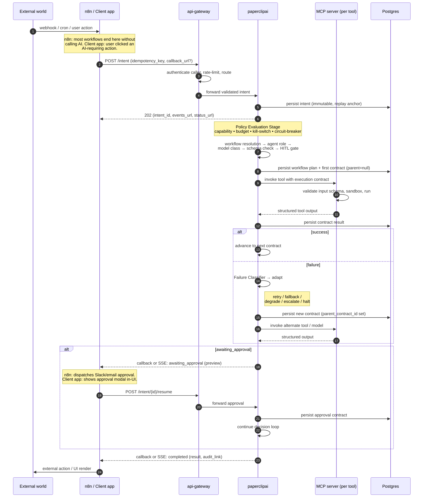

# ARCHITECTURE.md

## Deterministic Agent Control Plane — VPS-per-Client Architecture

## Status

RECOMMENDED — v3.2 — n8n as primary automation platform and client-facing apps as co-equal callers of paperclipai. paperclipai as callable AI decision service. MCP as portable tool protocol. Coolify as fleet manager. Agents portable between paperclipai and platform.claude.com.

---

# 1. Purpose

This platform enables, per client VPS:

- General-purpose automations (most of the volume — handled entirely in n8n)
- AI-assisted automation workflows (subset — n8n calls paperclipai when reasoning is needed)
- Client-facing AI features (dashboards, chat UIs, in-app assistants — call paperclipai directly through api-gateway)
- Policy-gated autonomous AI workflows
- Multi-step, multi-agent orchestration
- Controlled adaptive execution (retry, fallback, degradation, escalation)
- Deterministic + probabilistic hybrid execution
- Full auditability and replay for AI decisions
- Cross-platform agent portability (paperclipai ↔ platform.claude.com)

**Design priorities, in order:**

1. Simplicity (minimum moving parts per VPS)
2. Control
3. Safety
4. Determinism (structural; see §6)
5. Portability (agents written once, run on either platform)
6. Adaptability (controlled only — new decisions, never runtime mutation)
7. Cost governance

**Non-goals:** cross-tenant orchestration, peer-to-peer agent swarms, runtime self-correction, distributed reasoning. One client = one VPS = one brain.

---

# 2. Core Invariants

1. There is exactly one AI decision system per VPS (paperclipai).
2. api-gateway is the only external interface. It routes AI requests to paperclipai and automation requests to n8n, authenticates all callers, and enforces rate limits and per-caller quotas.
3. paperclipai has two classes of caller: n8n (automation workflows that need AI) and client-facing apps (dashboards, chat UIs, in-app assistants). Both use the same `/intent` contract.
4. Most automation workflows never touch paperclipai. AI is called only when reasoning, classification, or generation is needed.
5. Agents never coordinate directly. All A2A handoffs route through paperclipai.
6. Execution never makes decisions.
7. Adaptation is a new decision, not runtime behavior.
8. All AI execution is governed by an explicit contract, regardless of who called paperclipai.
9. Tools are MCP servers. Same tools are consumable by paperclipai and by platform.claude.com.
10. Observability is write-only from tools. Its data enters decisions only through governed interfaces.
11. All AI workflows are replayable from stored state.
12. Every adaptation is a link in a causation chain and is itself replayable.
13. Fleet-level operations (deploy, kill-switch, rollback) flow through Coolify. No ad-hoc SSH.

Invariants 1, 2, 3, and 9 are the foundation.

---

# 3. System Overview

## 3.1 Per-VPS stack

```
          External world                       End users
    (webhooks, cron, integrations)         (of the client's apps)
              │                                    │
              ▼                                    ▼
       ┌──────────────┐                    ┌──────────────┐
       │     n8n      │                    │ Client-facing│
       │   (primary   │                    │     apps     │
       │  automation) │                    │ (UI, chat,   │
       │              │                    │  dashboards) │
       └──────┬───────┘                    └──────┬───────┘
              │                                    │
     ┌────────┼──────────┐                         │
     │        │          │                         │
 (most      (AI?)     (egress                      │
  paths)      │       actions)                     │
     │        │          │                         │
     ▼        │          ▼                         │
  External    │       External                     │
  actions     │       actions                      │
              │                                    │
              └────────┬───────────────────────────┘
                       ▼
                ┌──────────────┐
                │ api-gateway  │  ◄── ONLY EXTERNAL INTERFACE
                │ (auth, rate  │      (routes AI → paperclipai,
                │  limit,      │       automation triggers → n8n,
                │  routing)    │       authenticates all callers)
                └──────┬───────┘
                       ▼
                ┌──────────────┐
                │ paperclipai  │  ◄── AI DECISION SERVICE
                │              │      (called by n8n AND client apps;
                │              │       same `/intent` contract for both)
                └──────┬───────┘
                       ▼
                ┌──────────────┐
                │ MCP Clients  │  ◄── EXECUTION BOUNDARY
                └──────┬───────┘
                       ▼
     ┌─────────────────┼─────────────────┐
     ▼                 ▼                 ▼
┌────────────┐   ┌────────────┐   ┌─────────────┐
│ CLI MCP    │   │ LLM MCP    │   │ Action MCP  │
│ (OpenClaw, │   │ (Claude,   │   │ (wraps n8n  │
│  scanners) │   │  providers)│   │  webhooks)  │
└────────────┘   └────────────┘   └─────────────┘
                       │
                       ▼
              ┌───────────────────┐
              │  Postgres (state, │
              │  audit, contracts,│
              │  pgvector)        │
              │  Redis (cache)    │
              └───────────────────┘
```

**Two caller patterns:**

- **n8n → paperclipai:** automation workflows that need AI. The majority of automation volume never reaches paperclipai at all (pure automation paths on the left). When AI is needed, n8n POSTs an intent and receives results via callback.
- **Client apps → paperclipai:** user-facing features — chat UIs, dashboards with "analyze this" buttons, in-app assistants, report generators. Client apps authenticate through api-gateway and POST the same `/intent` payload. They typically receive results via polling `/status` or an SSE stream instead of a callback URL.

In both cases, paperclipai's behavior is identical — same contracts, same policy evaluation, same audit, same adaptive engine. The only difference is the response channel.

## 3.2 Fleet layer

```
     Your control VPS
     ├── Coolify (manages all client VPSes as "servers")
     ├── Langfuse (central LLM observability across fleet)
     ├── Grafana + Loki (central logs across fleet)
     ├── MCP registry (shared tool servers, versioned artifacts)
     └── Git repo (paperclipai code, n8n workflows, MCP servers, agents/)
              │
     ┌────────┼────────┬────────┬────────┐
     ▼        ▼        ▼        ▼        ▼
   VPS #1  VPS #2  VPS #3  VPS #4  VPS #N
  (client)(client)(client)(client)(client)
```

Adding a new client: provision a VPS with your provider, add it to Coolify, deploy the template. Minutes.

## 3.3 End-to-End Sequence (v3.2)

The authoritative flow from external trigger to final output. Replaces the v1 8-step sequence diagram. Both caller classes — n8n and client apps — produce the same intent and traverse the same internal path.



**Invariants this flow enforces** (carry forward from v1):

- Only paperclipai decides. api-gateway authenticates and routes only. MCP servers execute only. Tools never reason or loop.
- Every state change is persisted to Postgres before the next step runs. The intent is the canonical replay anchor.
- HITL is allowed only at explicit gates emitted by paperclipai. The caller surface (n8n or client app) handles UX.
- Adaptation produces a new contract with `parent_contract_id` set — never a runtime mutation.
- Observability records, never controls.

**What's collapsed from v1:** the explicit Execution Queue is now an internal Postgres-backed task table inside paperclipai, not a separate component. Same flow-control semantics, fewer moving parts.

---

# 4. n8n — Primary Automation Platform

n8n is the main event loop for automations on each client VPS. Most workflows run end-to-end inside n8n without ever calling paperclipai. n8n is one of two caller classes for paperclipai — the other is client-facing apps (§4A).

## 4.1 What n8n handles entirely on its own

- Scheduled jobs (daily reports, weekly reconciliations, cron everything)
- Event-driven integrations (new CRM row → update spreadsheet; form submission → create Odoo contact)
- Data sync and ETL between client systems
- Deterministic notifications and alerts
- File operations and document routing
- Payment processing triggers
- Any workflow where the logic is "if X then Y" with no reasoning step

This is the majority of automation work. It's where n8n's integration library pays off.

## 4.2 When n8n calls paperclipai

Only when a workflow step requires AI. Typical cases:

- Classify or extract from unstructured input (email, document, form free-text)
- Draft content (response email, summary, report section)
- Decide routing where rules aren't precise enough
- Multi-step agent workflows (research, analyze, report)
- Anything where a human would otherwise read something and decide

n8n is the caller; paperclipai is the service. A well-designed n8n workflow minimizes paperclipai calls — they cost money and add latency.

## 4.3 Egress for paperclipai

When paperclipai needs to take an external action (send email, update Odoo, post to Slack), it does not call external APIs directly. It calls a registered **MCP tool** that wraps an n8n webhook. This keeps paperclipai free of integration SDKs and keeps all external actions running through n8n's audit and integration layer.

## 4.4 What n8n does NOT do

- Make AI decisions (delegates to paperclipai)
- Maintain state that paperclipai needs for replay (paperclipai owns its own state)
- Call CLI tools like OpenClaw directly (those are MCP tools, behind paperclipai)

## 4.5 Workflow taxonomy

A useful mental model for classifying n8n workflows:

| Type | Calls paperclipai? | Example |
|---|---|---|
| **Pure automation** | Never | "Every Monday at 9am, pull Stripe balances and email the team" |
| **AI-assisted** | Once per run | "New inbound email → classify intent → route to the right team" |
| **Agentic** | Multiple times per run, with callbacks | "New lead → qualify → draft response → await approval → send" |
| **Action tool** | Called *from* paperclipai | "Send Slack message," "Update Odoo contact" — webhooks wrapped as MCP |

The majority of workflows are type 1. Types 2 and 3 are where the architecture earns its keep.

---

# 4A. Client-Facing Apps — Direct Callers

Client-facing apps (customer dashboards, in-app chat, assistant widgets, "run analysis" buttons, report generators) call paperclipai directly through api-gateway. This is the second caller class.

## 4A.1 Why direct, not via n8n

Client-facing AI features are synchronous or near-synchronous from the user's perspective — someone clicks "summarize" and expects a response. Routing through n8n adds latency, a second workflow engine in the loop, and visible complexity with no benefit. api-gateway authenticates the app, paperclipai handles the intent, the app receives results directly.

## 4A.2 Response channels

Client apps generally do not provide a `callback_url` — they receive results inline:

- **Polling `/intent/{id}/status`** — simplest, appropriate for short interactions (< 30s).
- **Server-Sent Events stream via `/intent/{id}/events`** — recommended for chat-like UIs and for any intent that produces progressive output (tool calls, partial results, awaiting_approval transitions).
- **Optional `callback_url`** — if the client app has its own webhook receiver, it can use the callback pattern like n8n. Useful for apps that want fire-and-forget with async notification.

## 4A.3 Authentication

api-gateway authenticates client apps via API keys (per-app, per-client scope). Each API key carries claims:

- `app_id` — which client app is calling.
- `capabilities` — which workflows/agents this app is authorized to invoke.
- `budget_pool` — which spending pool calls count against.

paperclipai's Policy Evaluation Stage reads these claims from the validated token and applies them just like n8n-originated policy checks. Same contract shape, same audit trail, same governance.

## 4A.4 Human-in-the-loop from client apps

When a contract emits `awaiting_approval`, client apps handle the approval UX themselves — show a modal with the preview and approve/reject buttons, then call `/intent/{id}/resume`. This is the direct equivalent of what n8n does for automation-driven flows. The app is the approval surface because the user is already in the app.

## 4A.5 What client apps do NOT do

- Make AI decisions (paperclipai does)
- Call MCP tools directly (only paperclipai does)
- Bypass the contract system (every AI call goes through `/intent`)
- Maintain AI state beyond what paperclipai exposes via `/status` or `/events`

---

# 5. paperclipai — AI Decision Service

## 5.1 Responsibilities

Intent validation. Workflow planning. Agent role assignment. Tool selection. Model class resolution. Policy enforcement. Capability validation. Budget enforcement. Failure classification. Adaptive execution decisions. Agent coordination. Contract generation. Replay and audit emission.

paperclipai is a callable service, not a standalone application. Its callers are n8n (for AI-assisted automations) and client-facing apps (for user-facing AI features). Both use the same contract.

## 5.2 External surface

Four HTTP endpoints through the api-gateway.

- `POST /intent` — any caller submits a normalized intent. Returns 202 immediately with `intent_id`; real work runs async.
- `POST /intent/{intent_id}/resume` — caller signals that a paused workflow (e.g., human approval) should continue.
- `GET /intent/{intent_id}/status` — poll for status; also returns audit chain links.
- `GET /intent/{intent_id}/events` — Server-Sent Events stream of contract-level events for this intent (for chat UIs and progressive-output apps). Optional for callers that prefer polling or webhook callbacks.

Everything else is internal.

## 5.3 Internal structure

```
paperclipai
├── Intent Handler              (validates, dedupes by idempotency_key)
├── Orchestration Engine        (drives the decision loop)
├── Agent Registry              (roles, capabilities, model-class bindings)
├── Execution Planner           (produces contracts; includes mode resolution)
├── Policy Evaluation Stage     (capability, budget, kill-switch, circuit-breaker — unified)
├── Adaptive Execution Engine
│   ├── Failure Classifier      (structured rules + pinned LLM fallback)
│   ├── Retry / Fallback / Degradation / Escalation resolvers
│   └── Termination Guard       (loop limits, monotone cost)
├── Agent Coordination Engine   (delegation; capability matching)
├── Tool Capability Registry    (all tools are MCP servers)
├── MCP Client Layer            (invokes tools; see §11)
├── Contract System             (generation, versioning, causation chain)
├── Callback Emitter            (POSTs status to n8n callback URLs)
└── Memory Interface            (sole access path to state/knowledge/cache)
```

## 5.4 What paperclipai does NOT do

- Receive webhooks from external services (n8n does that)
- Call external APIs directly for actions (n8n does that, via MCP-wrapped webhooks)
- Handle long-running human approval UX (n8n does that — paperclipai just emits `awaiting_approval`)
- Run cron/schedules (n8n does that)
- Parse email, HTML, or arbitrary payloads (n8n normalizes upstream)
- Execute tools directly (MCP servers do that)

This separation keeps paperclipai small.

## 5.5 Runtime

Single container. Python (FastAPI + async) or Go. State in Postgres. Background decision loop driven by a Postgres-backed task table. No separate workflow engine, no Temporal, no broker. MCP clients (stdio or HTTP) to invoke tools.

---

# 6. The Intent Contract

The most important seam in the system. Used identically by n8n and client-facing apps. Version it carefully.

## 6.1 Ingress — caller submits an intent

**Endpoint:** `POST /intent`

```json
{
  "intent_id": "01HX...",
  "source": "n8n:workflow_42:execution_9876  |  app:customer_portal:session_abc",
  "caller_type": "n8n | client_app",
  "trigger_type": "webhook | cron | integration | manual | user_action",
  "requested_outcome": "qualify_and_respond",
  "target": "lead_abc",
  "payload": { /* trigger-specific data, already normalized */ },
  "constraints": {
    "read_only": false,
    "environment": "prod",
    "max_cost_usd": 2.00
  },
  "idempotency_key": "gmail_msg_xyz  |  app_session_xyz_request_5",
  "callback_url": "optional — used by n8n and callback-capable client apps",
  "correlation_id": "optional"
}
```

**Response (always 202):**

```json
{
  "intent_id": "01HX...",
  "status": "accepted",
  "estimated_duration_seconds": 30,
  "audit_link": "https://paperclipai.cfpa.../intents/01HX...",
  "events_url": "https://paperclipai.cfpa.../intent/01HX.../events",
  "status_url": "https://paperclipai.cfpa.../intent/01HX.../status"
}
```

- `idempotency_key` is required. paperclipai de-dupes on it.
- `caller_type` distinguishes audit and policy paths — n8n calls and client-app calls are subject to the same contract but may be governed by different capability/budget rules.
- `callback_url` is optional. n8n always uses it. Client apps may use callback, poll `/status`, or stream `/events` depending on their UX needs.
- `max_cost_usd` overrides the default budget, subject to policy limits.

## 6.2 Callback — paperclipai notifies the caller (optional)

**Endpoint:** `POST {callback_url}` (provided by the caller; used by n8n and by callback-capable client apps)

```json
{
  "intent_id": "01HX...",
  "correlation_id": "...",
  "status": "completed | failed | awaiting_approval | halted",
  "result": {
    "schema_ref": "qualify_and_respond_result@v1",
    "data": { /* structured output */ }
  },
  "adaptations_applied": 1,
  "cost_usd": 0.42,
  "audit_link": "https://paperclipai.cfpa.../contracts/chain/01HX...",
  "awaiting_approval": {
    "approval_id": "01HX...",
    "approval_prompt": "Send this email to jane@example.com?",
    "approval_ttl_seconds": 86400,
    "preview": { /* previewable data */ }
  }
}
```

The `awaiting_approval` block appears only when status is `awaiting_approval`. Whichever surface owns the approval UX (n8n for automation-triggered intents, the client app for user-triggered intents) calls `/intent/{intent_id}/resume` when the human acts.

## 6.3 Events stream — client apps consume progressive updates

**Endpoint:** `GET /intent/{intent_id}/events` (Server-Sent Events)

Emits one SSE event per contract state change (contract created, tool invoked, tool returned, adaptation emitted, awaiting_approval, completed, failed). Same data model as the callback payload, streamed incrementally. Best for chat UIs and any client surface that needs to show "thinking…" and progressive outputs.

```
event: contract_started
data: { "contract_id": "C1", "tool_name": "classify_lead_intent", "step_id": "classify" }

event: contract_completed
data: { "contract_id": "C1", "output_preview": {...}, "cost_usd": 0.02 }

event: awaiting_approval
data: { "approval_id": "...", "approval_prompt": "...", "preview": {...} }

event: completed
data: { "result": {...}, "adaptations_applied": 1, "cost_usd": 0.38 }
```

Connection closes on `completed`, `failed`, or `halted`. On `awaiting_approval`, the stream remains open and resumes emitting events after the caller posts `/resume`.

## 6.4 Resume — caller signals continuation

**Endpoint:** `POST /intent/{intent_id}/resume`

```json
{
  "approval_id": "01HX...",
  "decision": "approve | reject",
  "approver": "user_email_or_id",
  "notes": "optional free text"
}
```

paperclipai records the approval as a new contract in the causation chain, then resumes.

## 6.5 Egress — paperclipai calls MCP tools (which may wrap n8n)

paperclipai does not call n8n webhooks or any external API directly. Every action is invoked through an **MCP tool** registered in the Tool Capability Registry. Action tools internally wrap n8n webhooks.

See §11 for MCP details and §12 for the registry format.

---

# 7. Execution Contract

All AI execution is governed by a strict contract. The contract outlives any specific tool or protocol choice.

## 7.1 Contract fields

- `contract_id` (UUID)
- `parent_contract_id` (nullable — causation chain)
- `intent_id`, `workflow_id`, `workflow_version`, `step_id`
- `tool_name`, `tool_version` (pinned)
- `tool_implementation` (always `mcp` in v3.1, with transport details in the tool registry entry)
- `agent_role`
- `model_class` (e.g., `high_reasoning`, `low_cost_extract`) — not a model name
- `execution_mode` (`deterministic` | `probabilistic` | `hybrid`)
- `input_schema_ref`, `output_schema_ref` (versioned)
- `required_capabilities[]`
- `declared_side_effects[]`
- `cost_budget` (class + hard ceiling)
- `policy_decisions[]` (snapshot of policy evaluations that approved this contract)
- `observability.trace_id`
- `created_at`, `signed_by` (paperclipai instance + version)

## 7.2 Schema authoring

Canonical source: **JSON Schema 2020-12**. Codegen into Pydantic v2 (for paperclipai and Python MCP servers) and Zod (for any TypeScript MCP servers or n8n nodes). Keep JSON Schema as the language-neutral source of truth.

## 7.3 Storage

Append-only contract table in Postgres. Foreign key on `parent_contract_id`. Indexed on `intent_id` and `workflow_id`. Never updated, never deleted.

---

# 7A. Canonical Schemas

This section defines the four schemas that govern every artifact paperclipai produces or accepts. They are the same four schemas shown in the v1 sequence diagram; this section is the v3.2 authoritative version. JSON Schema 2020-12 is the source of truth (§7.2). Pydantic v2 (paperclipai, Python MCP servers) and Zod (TypeScript MCP servers, n8n custom nodes) are codegen targets — never authored directly.

**v3.2 additions are marked inline with `[v3.2]`.** All other fields carry over from v1.

## 7A.1 Intent Schema

The contract between any caller (n8n or client app) and paperclipai. Validated at `POST /intent` ingress before anything else runs.

```json
{
  "$id": "https://schemas.paperclipai/intent@v3.2",
  "$schema": "https://json-schema.org/draft/2020-12/schema",
  "type": "object",
  "required": [
    "intent_id",
    "source",
    "caller_type",
    "trigger_type",
    "requested_outcome",
    "payload",
    "constraints",
    "idempotency_key"
  ],
  "properties": {
    "intent_id":         { "type": "string", "format": "ulid" },
    "source":            { "type": "string", "description": "Free-form origin tag, e.g. 'n8n:workflow_42:exec_9876' or 'app:customer_portal:session_abc'" },
    "caller_type":       { "type": "string", "enum": ["n8n", "client_app"], "description": "[v3.2] Distinguishes the two caller classes for policy and audit." },
    "trigger_type":      { "type": "string", "enum": ["webhook", "cron", "integration", "manual", "user_action"] },
    "requested_outcome": { "type": "string", "description": "Names the workflow contract to resolve, e.g. 'qualify_and_respond'" },
    "target":            { "type": "string", "description": "Subject of the intent (lead_id, document_id, etc.)" },
    "payload":           { "type": "object", "description": "Trigger-specific normalized data. Caller is responsible for normalization." },
    "constraints": {
      "type": "object",
      "properties": {
        "read_only":     { "type": "boolean", "default": false },
        "environment":   { "type": "string", "enum": ["prod", "staging", "dev"] },
        "max_cost_usd":  { "type": "number", "minimum": 0 }
      }
    },
    "idempotency_key":   { "type": "string", "description": "Required. paperclipai de-dupes on (caller_type, idempotency_key)." },
    "callback_url":      { "type": "string", "format": "uri", "description": "[v3.2] Optional. n8n always sets it; client apps may omit and use SSE/polling instead." },
    "correlation_id":    { "type": "string" }
  },
  "additionalProperties": false
}
```

**Rules:**

- `intent_id` is caller-generated and must be a ULID. paperclipai will reject collisions (409).
- `(caller_type, idempotency_key)` is the de-dup key. Two intents with the same key resolve to the same `intent_id` and the same audit chain — the second submission returns the existing 202 payload.
- `caller_type` is the only field that lets policy distinguish automation traffic from user-app traffic. Both go through the same contract; policy can apply different budget/capability rules.
- `payload` schema is workflow-specific and is checked against `requested_outcome`'s declared input schema before workflow planning.
- `constraints.max_cost_usd` is a ceiling, not a target. Policy may lower it further; it cannot be raised above the per-caller cap.
- The 202 response (see §6.1) is part of this contract — `events_url` and `status_url` are always returned, `callback_url` is echoed only if the caller supplied one.

## 7A.2 Workflow Plan Schema

paperclipai's Execution Planner produces this artifact after policy passes. The plan is what the Adaptive Execution Engine walks. Persisted alongside the intent before any contract runs.

```json
{
  "$id": "https://schemas.paperclipai/workflow_plan@v3.2",
  "$schema": "https://json-schema.org/draft/2020-12/schema",
  "type": "object",
  "required": ["plan_id", "intent_id", "workflow_id", "workflow_version", "steps"],
  "properties": {
    "plan_id":           { "type": "string", "format": "ulid" },
    "intent_id":         { "type": "string", "format": "ulid" },
    "workflow_id":       { "type": "string", "description": "e.g. 'lead_qualification'" },
    "workflow_version":  { "type": "string", "pattern": "^\\d+\\.\\d+\\.\\d+$" },
    "agent_role":        { "type": "string", "description": "Which agent role from the registry is responsible for this plan" },
    "policy_snapshot": {
      "type": "object",
      "description": "[v3.2] Frozen result of Policy Evaluation Stage at planning time.",
      "required": ["capabilities_granted", "budget_class", "kill_switch", "circuit_state"],
      "properties": {
        "capabilities_granted": { "type": "array", "items": { "type": "string" } },
        "budget_class":         { "type": "string" },
        "budget_remaining_usd": { "type": "number" },
        "kill_switch":          { "type": "string", "enum": ["off", "advisory", "halt"] },
        "circuit_state":        { "type": "string", "enum": ["closed", "half_open", "open"] }
      }
    },
    "steps": {
      "type": "array",
      "minItems": 1,
      "items": {
        "type": "object",
        "required": ["step_id", "tool_name", "tool_version", "execution_mode", "input_schema_ref", "output_schema_ref"],
        "properties": {
          "step_id":           { "type": "string" },
          "tool_name":         { "type": "string" },
          "tool_version":      { "type": "string" },
          "model_class":       { "type": "string", "description": "Required when tool is an LLM MCP server" },
          "execution_mode":    { "type": "string", "enum": ["deterministic", "probabilistic", "hybrid"] },
          "input_schema_ref":  { "type": "string" },
          "output_schema_ref": { "type": "string" },
          "depends_on":        { "type": "array", "items": { "type": "string" } },
          "approval_gate":     { "type": "boolean", "default": false, "description": "If true, this step emits awaiting_approval before executing" },
          "fallback_strategy": {
            "type": "object",
            "properties": {
              "max_retries":      { "type": "integer", "minimum": 0, "maximum": 3 },
              "fallback_tool":    { "type": "string" },
              "degrade_to_class": { "type": "string" }
            }
          }
        },
        "additionalProperties": false
      }
    },
    "termination_guard": {
      "type": "object",
      "description": "[v3.2] Plan-scoped limits the Adaptive Engine cannot violate.",
      "properties": {
        "max_chain_depth":    { "type": "integer", "default": 5 },
        "max_total_cost_usd": { "type": "number" },
        "monotone_cost_on_degrade": { "type": "boolean", "default": true }
      }
    },
    "created_at":        { "type": "string", "format": "date-time" },
    "signed_by":         { "type": "string", "description": "paperclipai instance + version that produced this plan" }
  },
  "additionalProperties": false
}
```

**Rules:**

- The plan is immutable once written. Adaptive execution does not mutate the plan — it produces new contracts whose `parent_contract_id` references the contract the adaptation responded to.
- `policy_snapshot` is frozen at planning time so audit can show *what policy said when this plan was approved*, not just current policy.
- `steps[].tool_name` must resolve in the Tool Capability Registry (§12). Resolution failure → plan rejected, intent fails before any contract runs.
- `termination_guard` limits are enforced by the Adaptive Engine and cannot be exceeded by retries or fallbacks. Hitting a limit → halt + escalate.

## 7A.3 Execution Instruction Schema

Per-step contract sent to an MCP server. This is the on-the-wire artifact the MCP Client Layer hands to a tool. It is persisted in the contract table (§7) before invocation; the tool's structured output is persisted after.

```json
{
  "$id": "https://schemas.paperclipai/execution_instruction@v3.2",
  "$schema": "https://json-schema.org/draft/2020-12/schema",
  "type": "object",
  "required": [
    "contract_id",
    "intent_id",
    "plan_id",
    "step_id",
    "tool_name",
    "tool_version",
    "tool_implementation",
    "execution_mode",
    "input_schema_ref",
    "output_schema_ref",
    "input",
    "cost_budget",
    "policy_decisions",
    "observability"
  ],
  "properties": {
    "contract_id":        { "type": "string", "format": "ulid" },
    "parent_contract_id": { "type": ["string", "null"], "format": "ulid", "description": "[v3.2] Causation chain. Null only for the first contract in an intent." },
    "intent_id":          { "type": "string", "format": "ulid" },
    "plan_id":            { "type": "string", "format": "ulid" },
    "workflow_id":        { "type": "string" },
    "workflow_version":   { "type": "string" },
    "step_id":            { "type": "string" },
    "tool_name":          { "type": "string" },
    "tool_version":       { "type": "string" },
    "tool_implementation": {
      "type": "object",
      "description": "[v3.2] Always 'mcp' in v3.1+. Transport details snapshotted from the registry at resolution time.",
      "required": ["protocol", "transport"],
      "properties": {
        "protocol":   { "type": "string", "const": "mcp" },
        "transport":  { "type": "string", "enum": ["stdio", "http"] },
        "endpoint":   { "type": "string", "description": "URL for http transport, command-array digest for stdio" },
        "image_digest": { "type": "string", "description": "Container digest pinning for replay" }
      }
    },
    "agent_role":         { "type": "string" },
    "model_class":        { "type": "string" },
    "execution_mode":     { "type": "string", "enum": ["deterministic", "probabilistic", "hybrid"] },
    "input_schema_ref":   { "type": "string" },
    "output_schema_ref":  { "type": "string" },
    "input":              { "type": "object", "description": "Validated against input_schema_ref before invocation" },
    "required_capabilities": { "type": "array", "items": { "type": "string" } },
    "declared_side_effects": { "type": "array", "items": { "type": "string" } },
    "cost_budget": {
      "type": "object",
      "required": ["class", "ceiling_usd"],
      "properties": {
        "class":       { "type": "string" },
        "ceiling_usd": { "type": "number", "minimum": 0 }
      }
    },
    "policy_decisions": {
      "type": "array",
      "description": "Snapshot of every policy check that approved this contract.",
      "items": {
        "type": "object",
        "required": ["policy", "decision", "evaluated_at"],
        "properties": {
          "policy":       { "type": "string" },
          "decision":     { "type": "string", "enum": ["allow", "deny", "advisory"] },
          "reason":       { "type": "string" },
          "evaluated_at": { "type": "string", "format": "date-time" }
        }
      }
    },
    "observability": {
      "type": "object",
      "required": ["trace_id"],
      "properties": {
        "trace_id":  { "type": "string" },
        "span_id":   { "type": "string" },
        "langfuse_session_id": { "type": "string" }
      }
    },
    "caller_context": {
      "type": "object",
      "description": "[v3.2] Echo of the caller_type and original source for tool-level audit.",
      "properties": {
        "caller_type": { "type": "string", "enum": ["n8n", "client_app"] },
        "source":      { "type": "string" }
      }
    },
    "created_at": { "type": "string", "format": "date-time" },
    "signed_by":  { "type": "string" }
  },
  "additionalProperties": false
}
```

**Rules:**

- `parent_contract_id` is the causation chain anchor. The first contract of an intent has it null; every adaptation contract sets it to the contract that triggered the adaptation. Audit traversal is `WHERE intent_id = ? ORDER BY created_at`, then reconstruct the tree via `parent_contract_id`.
- `tool_implementation.image_digest` is required for replay. If the registry has rotated the digest since this contract ran, transcript replay still works; re-execution replay must pull the original digest from the mirrored registry (§15).
- `input` must validate against `input_schema_ref` before the MCP server is invoked. Validation failure is a paperclipai-side error, not a tool error — it never reaches the MCP server.
- `policy_decisions` is the snapshot used for audit. Adding a check here later is forbidden — instead, emit a new contract with the additional check.
- MCP servers receive only the fields they need (`tool_name`, `tool_call`, `input`). The full Execution Instruction is paperclipai-internal — the MCP wire format is the subset the MCP protocol defines.

## 7A.4 Tool Output Schema

What every MCP server returns. Persisted as the contract result, indexed for replay, and surfaced to the caller via callback / SSE / status.

**Bumped to `@v3.3` from `@v3.2` during Phase 0 implementation.** The previous `allOf` / `if` / `then` formulation expressed the success-vs-failure constraint correctly in JSON Schema but was not translatable by `datamodel-code-generator` into Pydantic validators, leaving model-level enforcement absent. The discriminated-union form below is semantically equivalent and produces a `ToolOutput = ToolOutputSuccess | ToolOutputFailure` Pydantic union with a working discriminator on `status`. No callers were on `@v3.2` yet, so there is no migration cost.

```json
{
  "$id": "https://schemas.paperclipai/tool_output@v3.3",
  "$schema": "https://json-schema.org/draft/2020-12/schema",
  "title": "ToolOutput",
  "description": "Structured output from any MCP server invocation.",
  "discriminator": { "propertyName": "status" },
  "oneOf": [
    { "$ref": "#/$defs/ToolOutputSuccess" },
    { "$ref": "#/$defs/ToolOutputFailure" }
  ],
  "$defs": {
    "ToolOutputSuccess": {
      "type": "object",
      "title": "ToolOutputSuccess",
      "required": ["contract_id", "status", "schema_ref", "data", "completed_at"],
      "properties": {
        "contract_id": { "type": "string", "format": "ulid" },
        "status":      { "type": "string", "const": "success" },
        "schema_ref":  { "type": "string", "description": "Echoes the contract's output_schema_ref for replay validation" },
        "data":        { "type": "object", "description": "Structured output. Validated against schema_ref before persistence." },
        "metrics":              { "$ref": "#/$defs/ToolMetrics" },
        "side_effects_observed": {
          "type": "array",
          "description": "Side effects the tool actually performed. Must be a subset of contract.declared_side_effects.",
          "items": { "type": "string" }
        },
        "transcript":   { "$ref": "#/$defs/ToolTranscript" },
        "completed_at": { "type": "string", "format": "date-time" }
      },
      "additionalProperties": false
    },
    "ToolOutputFailure": {
      "type": "object",
      "title": "ToolOutputFailure",
      "required": ["contract_id", "status", "schema_ref", "error", "completed_at"],
      "properties": {
        "contract_id": { "type": "string", "format": "ulid" },
        "status":      { "type": "string", "const": "failure" },
        "schema_ref":  { "type": "string" },
        "error":       { "$ref": "#/$defs/ToolError" },
        "metrics":     { "$ref": "#/$defs/ToolMetrics" },
        "side_effects_observed": {
          "type": "array",
          "items": { "type": "string" }
        },
        "transcript":   { "$ref": "#/$defs/ToolTranscript" },
        "completed_at": { "type": "string", "format": "date-time" }
      },
      "additionalProperties": false
    },
    "ToolError": {
      "type": "object",
      "title": "ToolError",
      "description": "Layered for the Failure Classifier.",
      "required": ["code", "message"],
      "properties": {
        "code":      { "type": "string", "description": "Structured error code (layer 1 of Failure Classifier). Examples: QUOTA_EXCEEDED, SCHEMA_VIOLATION, UPSTREAM_TIMEOUT, AUTH_FAILED." },
        "message":   { "type": "string" },
        "category":  { "type": "string", "enum": ["transient", "permanent", "policy", "schema", "upstream"], "description": "Hint for adaptation strategy." },
        "retriable": { "type": "boolean" },
        "details":   { "type": "object" }
      },
      "additionalProperties": false
    },
    "ToolMetrics": {
      "type": "object",
      "title": "ToolMetrics",
      "description": "Tool-emitted execution metrics. Write-only into observability — never re-enters decisions except through Policy Evaluation.",
      "properties": {
        "duration_ms":         { "type": "integer", "minimum": 0 },
        "cost_usd":            { "type": "number", "minimum": 0 },
        "model_used":          { "type": "string", "description": "Concrete model name. Distinct from contract.model_class." },
        "model_version":       { "type": "string" },
        "input_tokens":        { "type": "integer" },
        "output_tokens":       { "type": "integer" },
        "upstream_latency_ms": { "type": "integer" }
      },
      "additionalProperties": false
    },
    "ToolTranscript": {
      "type": "object",
      "title": "ToolTranscript",
      "description": "Probabilistic-mode tools must include enough to reconstruct the LLM call.",
      "properties": {
        "messages":           { "type": "array" },
        "system_prompt_hash": { "type": "string" },
        "stop_reason":        { "type": "string" }
      },
      "additionalProperties": false
    }
  }
}
```

**Rules:**

- `status` is the discriminator. Pydantic validation rejects `{status: "success"}` without `data` and `{status: "failure"}` without `error` at the model level — no runtime conditional needed.
- `data` is validated against `schema_ref` before the contract result is persisted as success. A schema violation flips the status to `failure` with `error.code = "SCHEMA_VIOLATION"` — the tool's reported success is overridden.
- `side_effects_observed` must be a subset of the contract's `declared_side_effects`. An undeclared side effect is a contract violation: the contract is recorded as `failure`, kill-switch evaluation runs, and audit flags it. This is the enforcement of §2 invariant 10 (write-only observability).
- `error.code` is the entrypoint for layer 1 of the Failure Classifier (§9). Layer 2 (pattern match on `error.message` / `error.details`) and layer 3 (LLM fallback classifier) only run if `code` is missing or unrecognized.
- `transcript` must be present for probabilistic-mode contracts so transcript replay (§15) can run without re-invoking the model. For deterministic contracts, it can be omitted.
- Tool output is **the only data MCP servers produce.** They do not write to memory, do not emit logs into paperclipai's decision path, and do not call paperclipai back. The Tool Output schema is the entire contract surface from tool to control plane.

**Codegen note:** authoring schemas as discriminated unions instead of conditional `allOf` / `if` / `then` is the v3.3+ convention for any schema with mutually-exclusive shape variants. `datamodel-code-generator` translates `oneOf` + `discriminator` into a Pydantic `Union[...]` with `Field(discriminator=...)`; conditional schemas are silently dropped.

## 7A.5 Schema lifecycle

- All schemas live in `schemas/` in the repo, versioned by `@vN` suffix on `$id`.
- Bumping a schema (breaking change): add `@vN+1`, update workflow definitions that consume it, leave `@vN` in place for replay of old intents.
- Codegen runs in CI: `schemas/*.json` → Pydantic v2 (`paperclipai/generated/`) and Zod (`packages/contracts/`). Hand-edited generated files fail CI.
- Replay validation always uses the schema version recorded on the contract, not the current schema. This is what makes 7-year retention (§15) survivable across breaking changes.

---

# 8. Execution Modes

**Deterministic:** CLI tools (via MCP), Postgres queries, action tools (n8n webhooks via MCP). Replay = re-execute.

**Probabilistic:** LLM reasoning (via LLM MCP server). Structured outputs required. Replay = transcript playback. Re-execution mode available for re-qualification against replacement models.

**Hybrid:** Reasoning → structured plan → deterministic execution. Each phase is its own contract.

---

# 9. Adaptive Execution

Adaptation occurs **only after execution completes**.

```
Execution Result
      ↓
Failure Classifier (3 layers: structured codes → pattern match → LLM fallback)
      ↓
Adaptive Decision (retry | fallback | degrade | escalate | halt)
      ↓
Termination Guard (chain ≤ 5, monotone cost on degrade, no revisits)
      ↓
New Contract (parent_contract_id set)
```

**Retry:** same tool, same contract, new attempt. Cap 3.
**Fallback:** different tool or model class. Cap 2.
**Degradation:** strictly lower cost class.
**Escalation:** emit `awaiting_approval` on the callback. n8n handles UX.
**Halt:** terminate, record audit event, emit `failed`.

Forbidden: runtime mutation, MCP server retries, tool self-correction, adaptation not recorded as a new contract.

---

# 10. Agent Coordination

Agents never communicate directly.

```
Agent A result
      ↓
paperclipai interprets (new decision)
      ↓
paperclipai issues contract for Agent B
```

Non-negotiable.

---

# 11. MCP — The Tool Protocol

All tools are MCP servers. This is the v3.1 reversal from v3.0 — MCP comes back, because it's what makes agents portable between paperclipai and platform.claude.com.

## 11.1 Why MCP

- **Cross-platform portability.** The same MCP server works as a tool for paperclipai *and* for agents on platform.claude.com.
- **Uniform execution boundary.** CLI tools, LLM calls, and action webhooks all look identical to paperclipai — one invocation pattern.
- **Isolation.** Each tool runs in its own process (stdio) or container (HTTP), with its own dependencies.
- **Schema-first.** MCP mandates JSON Schema for tool inputs and outputs — aligns with §7.2.

## 11.2 Three tool categories, same protocol

**CLI MCP servers** — wrap native CLI tools (OpenClaw, Claude CLI, dependency scanners, file tools). The MCP server is a thin shim that validates input, shells out, and returns structured output. Typically stdio transport.

**LLM MCP servers** — wrap model providers. A single LLM MCP server can route requests by `model_class` to Anthropic, OpenAI, or others, with fallback and retry behavior pinned into the server's config. This is where your model-class abstraction lives.

**Action MCP servers** — wrap n8n webhooks for external actions. Each action (send_email, update_odoo_contact, notify_slack) is an MCP tool whose implementation is an HTTP call to an n8n webhook. paperclipai sees a clean MCP interface; n8n sees a normal webhook.

## 11.3 Transport

- **stdio** for local, trusted, low-latency tools (CLI wrappers on the same VPS). Default.
- **HTTP** for tools that need network boundaries (Action MCP servers → n8n, or for Claude Platform consumption).

## 11.4 What MCP does NOT do

MCP servers obey the same rules as tools did in v3.0:
- No decisions (they execute exactly what they're told)
- No retries (paperclipai's Adaptive Engine handles retries)
- No fallback logic (paperclipai decides fallbacks)
- No state (stateless per invocation, except for read-only config)

## 11.5 MCP server layout in the repo

```
mcp-servers/
├── cli/
│   ├── openclaw-mcp/          ← wraps OpenClaw
│   ├── dependency-scanner-mcp/
│   └── claude-cli-mcp/
├── llm/
│   └── llm-router-mcp/         ← routes by model_class
└── action/
    ├── send-email-mcp/         ← HTTP wrapper around n8n webhook
    ├── update-odoo-mcp/
    └── notify-slack-mcp/
```

Each server has its own Dockerfile. Coolify deploys the set to every client VPS. Versions pinned by container digest.

---

# 12. Tool Capability Registry

Every MCP tool is registered as YAML in the repo, loaded into Postgres on startup.

```yaml
- tool_name: dependency_scanner
  tool_version: "1.2.0"
  mcp:
    transport: stdio
    command: ["docker", "run", "--rm", "-i", "ghcr.io/acme/dependency-scanner-mcp@sha256:abc..."]
    tool_call: "scan_dependencies"
  input_schema: scan_input@v3
  output_schema: scan_output@v3
  declared_side_effects: []
  risk_level: low
  requires_capabilities:
    - github_read

- tool_name: reason_risk_analysis
  tool_version: "1.0.0"
  mcp:
    transport: stdio
    command: ["docker", "run", "--rm", "-i", "ghcr.io/acme/llm-router-mcp@sha256:def..."]
    tool_call: "prompt_with_schema"
  input_schema: risk_input@v1
  output_schema: risk_output@v1
  model_class: high_reasoning
  prompt_template: risk_analysis@v2
  declared_side_effects: []
  risk_level: low

- tool_name: notify_slack
  tool_version: "1.0.0"
  mcp:
    transport: http
    url: http://send-slack-mcp.internal:8080/mcp
    tool_call: "notify_slack"
  input_schema: notify_slack_input@v1
  output_schema: notify_slack_output@v1
  declared_side_effects: ["external:slack:post_message"]
  risk_level: low
  requires_capabilities:
    - slack_post
  notes: "MCP server internally calls n8n webhook for the actual Slack post"
```

CLI tools, LLM tools, and action tools are all just MCP tools. Uniform abstraction → smaller paperclipai core → portable across platforms.

---

# 13. Memory Layer

- **Postgres** — workflow state, contracts (append-only), audit log, tool registry snapshot, intent records.
- **pgvector** — knowledge and retrieval (same Postgres instance).
- **Redis** — ephemeral cache, short-lived locks.

All access through paperclipai's Memory Interface. MCP tools do not write to memory directly — they return outputs, paperclipai persists them.

---

# 14. Observability

**Per-VPS (local):**
- Structured JSON logs to stdout + disk
- OpenTelemetry traces emitted to the central collector

**Central (control VPS):**
- **Langfuse** — LLM traces, prompt versioning, evals, cost per model class, cost per client VPS.
- **Grafana + Loki + Tempo** — general logs and traces across the fleet.

Langfuse is the exception to per-VPS isolation. Each VPS points at it with a tenant-scoped API key.

**Invariant:** observability is write-only from MCP tools and paperclipai. Decisions consume it only through the Policy Evaluation Stage.

---

# 15. Replay & Audit

Replay requires versioned workflows, versioned contracts with causation chains, versioned MCP server container digests, pinned model versions, immutable event-sourced audit log.

**Transcript replay** (default) — reconstructs from stored contract results.
**Re-execution replay** — re-runs MCP tools and models (for re-qualification).

Retention: 7 years default, adjust per-client compliance. Mirror MCP server container images to cold storage if your primary registry ages them out.

---

# 16. Human-in-the-Loop

HITL UX lives in whichever surface originated the intent. paperclipai emits `awaiting_approval` and durably holds state. It does not care where the human actually approves.

**Two paths, same contract:**

1. **Automation-triggered (n8n is the caller):** paperclipai emits `awaiting_approval` on the callback. n8n dispatches the approval UX — Slack interactive message, email, form. Human acts; n8n POSTs `/intent/{id}/resume`.
2. **User-triggered (client app is the caller):** paperclipai emits `awaiting_approval` on the callback or the SSE stream. The client app shows a modal with the preview and approve/reject buttons — the user is already in the app, so this is the most natural surface. App POSTs `/intent/{id}/resume`.

**Common flow:**

1. paperclipai's Adaptive Engine decides a step requires human approval.
2. paperclipai writes the pending-approval record to Postgres, emits `awaiting_approval`.
3. The originating surface handles the UX and collects the decision.
4. The originating surface POSTs `/intent/{id}/resume`.
5. paperclipai records the approval as a new contract, resumes.
6. TTL expiry → `failed` or secondary escalation (policy-defined).

The approval record always includes the `approver` field so audit is complete regardless of which surface captured the decision.

---

# 17. End-to-End Example Trace

**Scenario:** An inbound email from a prospect arrives in a client's Gmail inbox. n8n already handles most client emails with simple rules; only unknown-sender inbound emails are routed through paperclipai for AI qualification.

### Step 1 — n8n ingress (pure automation path first)

Gmail trigger fires. n8n runs its normal flow:
- Rule check: is the sender in the known-senders table? (Known → routed to the appropriate folder, workflow done, paperclipai never called.)
- Unknown sender → continue.
- Enrich with Clearbit.
- POST to paperclipai:

```json
{
  "intent_id": "01HX...abc",
  "source": "n8n:inbound_email:exec_33",
  "trigger_type": "webhook",
  "requested_outcome": "qualify_and_respond",
  "target": "gmail_msg_xyz",
  "payload": { /* normalized email + enrichment */ },
  "constraints": { "max_cost_usd": 2.00, "read_only": false },
  "idempotency_key": "gmail_msg_xyz",
  "callback_url": "https://n8n.cfpa.../webhook/paperclip-result/exec_33"
}
```

paperclipai responds `202`.

### Step 2 — Policy evaluation

Capability, budget, kill-switch, circuit-breaker — all pass. Workflow `lead_qualification@v1.3.0` selected.

### Step 3 — Classify and lookup

Contract `C1` calls MCP tool `classify_lead_intent` (LLM MCP server, `model_class: low_cost_extract`). Output: `{ intent: "buying_signal", urgency: "high", confidence: 0.87 }`.

Contract `C2` calls MCP tool `crm_lookup` (Action MCP server → internally calls n8n webhook → Odoo). Output: `{ existing_contact: false, prior_interactions: 0 }`.

### Step 4 — Draft + fallback

Contract `C3` calls MCP tool `draft_response`. First attempt returns `QUOTA_EXCEEDED` from the LLM MCP server's primary provider.

Failure Classifier layer 1 matches → **fallback**.

Contract `C3'` with `model_class: balanced_writer_alt` (same MCP server, alternate provider route in the LLM MCP config). Succeeds.

### Step 5 — Approval decision

Contract `C4` evaluates approval policy. New contact + confidence > 0.8 → approval required.

paperclipai records pending-approval `A1`, emits callback:

```json
{
  "intent_id": "01HX...abc",
  "status": "awaiting_approval",
  "awaiting_approval": {
    "approval_id": "01HX...app1",
    "approval_prompt": "Approve outbound response to jane@example.com?",
    "approval_ttl_seconds": 86400,
    "preview": { /* email draft */ }
  }
}
```

### Step 6 — n8n handles approval UX

n8n callback workflow dispatches a Slack interactive message with the preview and approve/reject buttons. Human approves 3 hours later. n8n POSTs `/intent/01HX...abc/resume`.

### Step 7 — Send + update

Contract `C6` calls MCP tool `send_email` (Action MCP → n8n webhook → Gmail API).
Contract `C7` calls MCP tool `update_odoo_contact` (Action MCP → n8n webhook → Odoo).

### Step 8 — Final callback

```json
{
  "intent_id": "01HX...abc",
  "status": "completed",
  "result": {
    "schema_ref": "qualify_and_respond_result@v1",
    "data": { /* structured outcome */ }
  },
  "adaptations_applied": 1,
  "cost_usd": 0.38,
  "audit_link": "https://paperclipai.cfpa.../contracts/chain/01HX...abc"
}
```

n8n logs to the client's activity feed. Workflow complete.

### What this exercises

n8n owns most of the flow. paperclipai is called only for the reasoning-dependent steps. Every tool call is through MCP — the same MCP servers would work if this agent were deployed to platform.claude.com (§21). HITL fully handled by n8n. Full causation chain in Postgres.

---

# 18. Fleet Management with Coolify

## 18.1 Control VPS

- **Coolify** — connected to every client VPS as a "server." Deploys from Git, manages TLS, domains, environment variables, rolling updates.
- **Langfuse** — central LLM observability.
- **Grafana + Loki + Tempo** — central logs and traces.
- **MCP registry / container registry** — MCP server images pinned by digest, mirrored here.
- **Git remote** — source of truth for paperclipai, n8n workflows, MCP servers, `agents/`, tool registry, policies.

## 18.2 Per-client VPS

Each client VPS is a Coolify "server" running:

- paperclipai (container)
- n8n (container, with workflow exports from Git)
- api-gateway (container)
- core-postgres (Coolify-managed, pgvector enabled)
- redis (Coolify-managed)
- **MCP server containers** — one per tool, deployed alongside paperclipai

## 18.3 Operations

- **New client:** provision VPS → Coolify: Add Server → apply template.
- **Deploy code change:** `git push` → Coolify auto-deploys (rolling or canary).
- **Kill-switch:** edit policy YAML in Git, push, redeploy. For instant toggles, a Postgres-backed flags table on the control VPS polled every 30s by each paperclipai.
- **Rollback:** redeploy previous Git tag.
- **Add an MCP tool:** push new MCP server image → add registry entry → deploy. Available to every paperclipai in the fleet.

---

# 19. Tool Summary

| Layer | Choice | Why |
|---|---|---|
| External interface | **api-gateway** | Only ingress point; auth + routing for n8n and client apps |
| Primary automation | **n8n** | Handles most workflows without AI; rich integration library |
| Client-facing AI surface | **your app code (any framework)** | Calls paperclipai `/intent` directly via api-gateway; SSE for chat |
| AI decision service | **paperclipai** | Called by n8n and by client apps; same contract for both |
| Tool protocol | **MCP** | Portable across paperclipai and platform.claude.com |
| Tool execution — CLI | **MCP servers wrapping OpenClaw + Claude CLI** | Stdio MCP, local |
| Tool execution — LLM | **MCP server wrapping providers** | Model-class routing lives here |
| Tool execution — actions | **MCP servers wrapping n8n webhooks** | Uniform abstraction, portable |
| State + audit | **Postgres 16+** | WAL + append-only contracts |
| Vector store | **pgvector** | Same Postgres instance |
| Cache | **Redis** | — |
| Schema source | **JSON Schema 2020-12** → Pydantic / Zod | Language-neutral |
| Policy | **YAML rules + in-process evaluator** | ~200 lines; no OPA at this scale |
| Feature flags | **YAML in Git + optional Postgres flags table** for hot toggles | No OpenFeature/Flagd |
| Fleet deploy | **Coolify** | Replaces Ansible + Caddy + secrets |
| LLM observability | **Langfuse (central)** | Cross-VPS cost + eval visibility |
| Logs + traces | **OpenTelemetry → Grafana/Loki/Tempo (central)** | Fleet-wide observability |

Removed: Temporal, OPA, OpenFeature/Flagd, LiteLLM (the LLM MCP server covers routing), Activepieces (pick n8n), separate Flowise (unless used for client-facing visual builds).

---

# 20. Migration from Current State

1. **Pick one of n8n / Activepieces.** Migrate workflows. Delete the loser.
2. **Decide Flowise's role.** Remove if duplicative of paperclipai.
3. **Clean up duplicate Odoo services.**
4. **Wrap existing tools as MCP servers.** OpenClaw → `openclaw-mcp`; Claude CLI → `claude-cli-mcp`; LLM calls → `llm-router-mcp`. Each action webhook → an action MCP server. This is the biggest v3.1 step.
5. **Define the n8n ↔ paperclipai contract** (§6). Build the three endpoints.
6. **Move HITL UX into n8n workflows.**
7. **Stand up control VPS** with Coolify, Langfuse, Grafana stack, MCP registry.
8. **Codify the Tool Capability Registry as YAML** with MCP entries.
9. **Add causation chains to contracts.**
10. **Formalize the Failure Classifier layer 1** with enumerated error codes.
11. **Lock replay semantics** — transcript default, re-execution for re-qualification.
12. **Set up the `agents/` directory** (§21) for portability.

Greenfield: ~2–3 weeks. Migrating from current: ~4–5 weeks, mostly in steps 4 and 5.

---

# 21. Cross-Platform Agent Portability

v3.1 adds first-class support for writing agents once and running them on either paperclipai or platform.claude.com. This is enabled by MCP (§11) and a neutral agent spec.

## 21.1 What's portable

- **MCP tools** — written once, consumed by paperclipai via its MCP client and by platform.claude.com via Claude Agent SDK's native MCP support.
- **System prompts and templates** — plain text / markdown.
- **JSON Schema I/O contracts** — canonical across platforms.
- **Skills** (SKILL.md files) — markdown instruction files readable by both.
- **Agent definitions** — neutral YAML, consumed by a thin adapter per platform.
- **Evals / test cases** — the same eval suite runs against either platform.

## 21.2 What's NOT portable

- Orchestration (paperclipai's decision loop vs. Claude Platform's agent runtime)
- Policy enforcement (paperclipai's Policy Evaluation Stage)
- Contracts and causation chains (paperclipai-specific)
- Adaptive execution (retry/fallback/degrade/escalate with termination guards)
- n8n integration membrane

These belong to whichever control plane is running the agent.

## 21.3 Repo layout for portability

```
agents/
├── lead-qualifier/
│   ├── agent.yaml           ← neutral spec
│   ├── system_prompt.md
│   ├── schemas/             ← JSON Schema inputs/outputs
│   ├── skills/              ← SKILL.md files (or refs to shared skills/)
│   └── evals/               ← platform-neutral test cases
├── risk-analyzer/
│   └── ...
mcp-servers/                 ← shared tools (CLI, LLM, Action)
skills/                      ← shared SKILL.md files
adapters/
├── paperclipai/             ← registers agents in Tool Registry,
│                              plugs into policy + contract system
└── claude-platform/         ← generates Claude Agent SDK config,
                               deploys to platform.claude.com
```

## 21.4 Neutral `agent.yaml` spec

```yaml
name: lead-qualifier
version: 1.3.0
description: Classifies inbound leads, drafts responses, flags for human approval
model_class: balanced_writer
system_prompt_ref: system_prompt.md
skills:
  - sales-email-style
  - crm-field-extraction
tools:
  - classify_lead_intent
  - crm_lookup
  - draft_response
schemas:
  input: lead_intent_input@v1
  output: lead_intent_output@v1
evals:
  - evals/basic_qualification.yaml
  - evals/edge_cases.yaml
```

Both adapters read this file. paperclipai's adapter registers the agent's tools in the Tool Capability Registry and exposes the agent as an invokable role. Claude Platform's adapter generates the Agent SDK configuration and deploys.

## 21.5 When to run an agent on which platform

**Run on paperclipai when:**
- The agent is part of a client-facing automation that needs your contract/policy/audit stack
- Multi-tenant governance matters (almost always for client work)
- HITL via n8n's Slack/email flows is needed
- Cost governance and adaptive execution are required

**Run on platform.claude.com when:**
- You want Anthropic to handle infrastructure
- The agent is a standalone tool or Claude Code plugin
- Rapid prototyping before moving to paperclipai
- Public-facing chat agent use cases
- Shared skills / community publication

The same agent can be deployed to both — e.g., a prototype on Claude Platform, production on paperclipai. Only the adapter changes.

## 21.6 MCP as the portability linchpin

Adding MCP back (v3.0 → v3.1) is specifically what enables this. Without MCP, tools would have to be written twice (once in paperclipai's Execution Boundary style, once in Claude Agent SDK's tool style). With MCP, they're written once as a server and consumed uniformly.

This is the single highest-leverage decision in v3.1.

---

# 22. Final Invariant

```
api-gateway is the only door in.
n8n automates.
Client apps ask directly.
paperclipai decides, only when AI is needed.
MCP servers execute.
Adaptation creates new decisions.
Postgres remembers.
Coolify deploys.
Langfuse watches.
Agents are portable.
Contracts outlive tools.
```

---

[Diagram](https://www.notion.so/Diagram-34ac9ff03d62801bb0cedbece96a7249?pvs=21)

[One-Page Canon](https://www.notion.so/One-Page-Canon-349c9ff03d62801f9011fd4a7ec218bc?pvs=21)

[Tool Mapping](https://www.notion.so/Tool-Mapping-349c9ff03d6280ee88f9e825cff3b4cf?pvs=21)

[Development](https://www.notion.so/Development-34ac9ff03d6280a2ad05e5b82f6161a7?pvs=21)

[Repo](https://www.notion.so/Repo-34ac9ff03d6280b9a9ebc0f29ebb6c24?pvs=21)

[Model Fits](https://www.notion.so/Model-Fits-34ac9ff03d62805ebd0dc0e0d469898f?pvs=21)
